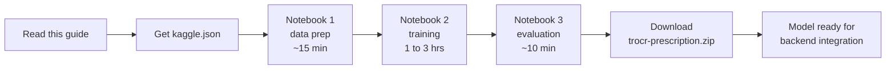

# Training the Prescription Handwriting OCR Model

A step-by-step recipe for training Medicare+'s doctor-handwriting OCR model on Google Colab using the [Doctor's Handwritten Prescription BD dataset](https://www.kaggle.com/datasets/mamun1113/doctors-handwritten-prescription-bd-dataset) by `mamun1113`.

Read this once end-to-end before you start so you know what's coming. The total time is ~3-4 hours, but most of it is the GPU training in the background — you only actively touch the keyboard for maybe 20-30 minutes total.

---

## The big picture



You run three Jupyter notebooks in Google Colab. They chain together through your Google Drive — each one writes outputs that the next one reads. You stay in the Colab browser tab the whole time.

The notebooks live in [notebooks/](notebooks/) inside this repo:

| Notebook | What it does | How long |
|----------|--------------|----------|
| [notebooks/01_data_prep.ipynb](notebooks/01_data_prep.ipynb) | Download dataset from Kaggle, split into train/val/test, save to Drive | ~15 min |
| [notebooks/02_train_trocr.ipynb](notebooks/02_train_trocr.ipynb) | Fine-tune `microsoft/trocr-base-handwritten` on the prescriptions | 1-3 hours |
| [notebooks/03_evaluate.ipynb](notebooks/03_evaluate.ipynb) | Measure accuracy, compare against baseline, produce report numbers | ~10 min |

---

## Prerequisites

Before you start, make sure you have all of these:

- A **Google account** (any one — the same one you use for Gmail/Drive is fine).
- A **Kaggle account** at https://www.kaggle.com (free).
- About **5 GB free space in your Google Drive** for the dataset and trained model.
- A **modern browser** (Chrome works best with Colab).

You do NOT need:

- A local GPU.
- Python installed locally.
- Anything else from this project running.

Training happens entirely in Colab.

---

## Step 1: Get your Kaggle API token

Notebook 1 downloads the dataset using the Kaggle API, which needs a token file called `kaggle.json`.

1. Go to https://www.kaggle.com and sign in.
2. Click your profile picture (top right) → **Settings**.
3. Scroll down to the **API** section.
4. Click **Create New API Token**.
5. A file called `kaggle.json` downloads to your computer. Remember where it is — you'll upload it in step 3.

> If you've created a token before and lost it, click **Expire API Token** first, then **Create New API Token** to make a new one. Old tokens stop working as soon as you create a new one.

---

## Step 2: Open notebook 1 in Colab

You have two ways to open the notebook. Pick whichever is easier.

**Option A — Upload directly:**

1. Go to https://colab.research.google.com
2. Click **File → Upload notebook**.
3. Pick `notebooks/01_data_prep.ipynb` from your local copy of this repo.

**Option B — Open from GitHub** (only works if you've pushed the repo to GitHub):

1. Go to https://colab.research.google.com
2. Click **File → Open notebook → GitHub** tab.
3. Paste your repo URL, then pick the notebook.

Once the notebook is open:

**Enable the GPU.** This is important — without it, training will be ~30x slower.

1. Click **Runtime → Change runtime type**.
2. Set **Hardware accelerator** to **T4 GPU**.
3. Click **Save**.

A small green checkmark with "T4" appears in the top-right of the notebook when the GPU is connected.

---

## Step 3: Run notebook 1 (data preparation, ~15 minutes)

The cleanest way to run any notebook is **Runtime → Run all**. But for this first one, do it cell by cell so you can see what's happening.

For each cell: click into the cell, then press **Shift+Enter**. A play button appears on the left while it's running, and a green checkmark appears when it's done.

Here's what each cell does:

### Cell: "Install dependencies"

Installs `kaggle`, `datasets`, `pandas`, `pillow`, `scikit-learn`, `matplotlib`. Takes 30-60 seconds.

**Success looks like:** A pile of "Successfully installed ..." lines, no red errors.

**If it fails:** Run the cell again. Pip downloads sometimes time out.

### Cell: "Mount Google Drive"

A popup window asks for permission to access your Drive.

**You will see:** A link "Connect to Google Drive". Click it, pick your Google account, click **Allow**.

**Success looks like:** `Mounted at /content/drive` printed in the cell output, then `Project root: /content/drive/MyDrive/medicare_plus_ocr`.

### Cell: "Authenticate to Kaggle"

This cell asks you to upload your `kaggle.json` from step 1.

**You will see:** A "Choose Files" button. Click it, select the `kaggle.json` you downloaded, click Open.

**Success looks like:** `Kaggle credentials in place.`

**If it fails (`401 Unauthorized` later on):** Your token has expired or didn't upload correctly. Regenerate the token (step 1) and re-run this cell.

### Cell: "Download & extract the dataset"

Downloads the Kaggle dataset (~200 MB) into your Drive. Takes 2-5 minutes depending on Colab's internet speed.

**Success looks like:** A progress bar, then `100%`, then a `ls -lah` listing showing folders/files inside the raw data dir.

**If it fails:** The most common cause is the token. The second-most-common cause is that you haven't clicked "I Accept" on the dataset's Kaggle page — go to https://www.kaggle.com/datasets/mamun1113/doctors-handwritten-prescription-bd-dataset in your browser, scroll to find a "Download" or "Accept rules" button, click it once, then re-run this cell.

### Cell: "Discover the dataset structure"

Prints out what CSV files and image files were found.

**Success looks like:** Something like:

```
CSV files found: 1
  /content/drive/MyDrive/medicare_plus_ocr/data/raw/Training/training_labels.csv

Image files found: 4745
Sample paths:
  /content/drive/MyDrive/medicare_plus_ocr/data/raw/Training/training_words/0.png
  ...
```

The exact paths depend on the dataset's internal layout. As long as you see thousands of image files, you're good.

### Cell: "Build a unified (image_path, label) table"

This is the smart part. It tries to read a CSV (if present) to map images to drug-name labels. If no usable CSV exists, it falls back to using the folder name as the label.

**Success looks like:**

```
Using CSV: /content/drive/MyDrive/.../training_labels.csv
  image col: IMAGE
  label col: MEDICINE_NAME
Total samples: 4745
Unique labels: 78
```

A small DataFrame preview shows below.

**If labels look wrong** (e.g. `Unique labels: 1` or all labels are numbers): the CSV's column names didn't match. Read the next section ("If the auto-detection picks the wrong columns") for the fix.

### Cell: "Quick exploration"

Shows the most common drug names and how many samples each has. Pure information — nothing to fix here.

### Cell: "Sample visualization"

Displays 12 random images with their labels.

**Success looks like:** A 3x4 grid of handwritten drug-name images. The labels above each image should match what's written in the image (you'll have to trust the dataset author here — you're not a Bangladeshi doctor).

### Cell: "Train / Validation / Test split"

Splits 4,700 samples into ~3,800 train / ~470 val / ~470 test.

**Success looks like:**

```
train: 3796
val  : 474
test : 475
```

(numbers vary a bit depending on the dataset)

### Cell: "Save as HuggingFace DatasetDict"

Saves all three splits to `/content/drive/MyDrive/medicare_plus_ocr/data/prepared` so notebook 2 can load them later.

**Success looks like:** `Saved DatasetDict to: /content/drive/MyDrive/medicare_plus_ocr/data/prepared` and a printed `DatasetDict` summary.

**Done with notebook 1.** You can close this Colab tab if you want — your data is saved to Drive.

### If the auto-detection picks the wrong columns

If after "Build a unified table" you see weird labels (numbers, garbage text, only 1 unique label), the CSV column auto-detection got confused. Fix it manually:

1. Run the **"Discover the dataset structure"** cell again. Note the path to the CSV file it found.
2. Add a new cell after it (Insert → Code cell below) and run this — replace the path with what you saw:

   ```python
   import pandas as pd
   df = pd.read_csv('/content/drive/MyDrive/medicare_plus_ocr/data/raw/Training/training_labels.csv')
   print('Columns:', list(df.columns))
   df.head()
   ```

3. The output tells you the actual column names. Often they're `IMAGE` and `MEDICINE_NAME`, but they could be different.
4. Edit the "Build a unified table" cell. Find this line:

   ```python
   img_col = next((cols_lower[k] for k in cols_lower if 'image' in k or 'file' in k or 'name' in k), None)
   label_col = next((cols_lower[k] for k in cols_lower if 'medicine' in k or 'label' in k or 'word' in k or 'text' in k), None)
   ```

5. Replace it with the actual column names directly, e.g.:

   ```python
   img_col = 'IMAGE'
   label_col = 'MEDICINE_NAME'
   ```

6. Re-run that cell and everything after it.

---

## Step 4: Run notebook 2 (training, 1-3 hours)

Open [notebooks/02_train_trocr.ipynb](notebooks/02_train_trocr.ipynb) in Colab the same way you opened notebook 1.

Again, make sure the **T4 GPU** is enabled (Runtime → Change runtime type). This is critical — training without a GPU on Colab CPU will take days, not hours.

This notebook is safe to run end-to-end with **Runtime → Run all**. But before you do, here's what to know:

### How long will it take?

On a free T4 with the default settings (10 epochs, batch size 8, ~3,800 training images):

- **First epoch:** ~15-25 minutes. Slow because data is being read from Drive for the first time and PyTorch caches the model.
- **Subsequent epochs:** ~8-15 minutes each.
- **Total:** ~1.5 to 3 hours.

### What you should see during training

After each epoch, a line like:

```
{'eval_loss': 0.42, 'eval_cer': 0.18, 'epoch': 1.0}
```

The number you care about is **`eval_cer`** (Character Error Rate). **Lower is better.** It should drop over epochs:

- Epoch 1: maybe 0.30 (model has barely started learning)
- Epoch 5: maybe 0.15
- Epoch 10: hopefully 0.08-0.12

If `eval_cer` is still dropping at epoch 10, you can train more (set `NUM_EPOCHS = 20` in the cell that defines training arguments and re-run from that cell).

### What CER means in plain English

CER = "fraction of characters the model got wrong." So 0.10 CER means the model gets 90% of characters right. For drug names of ~8 characters, that's roughly "one mistake per drug name" — usable, but not perfect. That's why the backend pipeline later will use fuzzy matching against a drug dictionary to clean these up.

### Possible problems during training

**"CUDA out of memory" error.**
Free T4 has limited memory and the default batch size of 8 sometimes pushes it over. Open the cell that defines the training args and change `BATCH_SIZE = 8` to `BATCH_SIZE = 4` (or even 2). Then re-run from that cell — you don't need to redo the data loading.

**Colab disconnects mid-training.**
Free Colab kicks you off after 12 hours of activity or 90 minutes of idle. The trainer saves a checkpoint after each epoch to your Drive at `/content/drive/MyDrive/medicare_plus_ocr/logs/checkpoints/`. If you get disconnected:

1. Reconnect to a fresh runtime (Runtime → Reconnect).
2. Re-run all the setup cells (Install, Mount Drive, Load model, Load dataset).
3. In the training arguments cell, find the line `output_dir=f'{LOG_DIR}/checkpoints'` and add a new line below it: `resume_from_checkpoint=True`. Or just call `trainer.train(resume_from_checkpoint=True)` in place of `trainer.train()`.
4. Run the training cell. It picks up where it left off.

**Training looks frozen.**
The first epoch is genuinely slow. If you don't see ANY output for 30+ minutes (not even loss logs every 50 steps), check that the GPU is still connected (top-right corner). If it shows "Disconnected", that's the issue.

### When training finishes

The last two cells save the trained model to:

- **Google Drive:** `/content/drive/MyDrive/medicare_plus_ocr/models/trocr-prescription/` — persistent, survives Colab session end.
- **Local download:** A file called `trocr-prescription.zip` (~400 MB) downloads to your computer.

Both contain the same model. Save the zip somewhere safe — that's the deliverable from this notebook.

---

## Step 5: Run notebook 3 (evaluation, ~10 minutes)

Open [notebooks/03_evaluate.ipynb](notebooks/03_evaluate.ipynb) in Colab.

This notebook produces the **numbers and charts you'll cite in your project report**. Run it end-to-end (**Runtime → Run all**).

Here's what each section produces:

| Section | What you get | Where it's saved |
|---------|--------------|------------------|
| 4. CER and WER | Test-set character error rate and word error rate | Printed in cell output |
| 5. Exact-match accuracy | % of drug names predicted exactly correctly | Printed in cell output |
| 6. Top-K accuracy | % of times the correct name is in the top-5 beam-search candidates | Printed in cell output |
| 7. Most common errors | Top 20 confusion pairs (e.g. `paracetamol → paracetamoo`) | Printed in cell output |
| 8. Side-by-side visualization | 12-image grid: handwriting + true label + predicted label, green if correct, red if wrong | Displayed in cell |
| 9. Before vs after | Bar charts comparing fine-tuned model to the un-trained baseline TrOCR | Displayed in cell |
| 10. Save report | Persists `summary.json` and `test_predictions.csv` to Drive | `/content/drive/MyDrive/medicare_plus_ocr/reports/` |

The most important output is the final `summary.json` printed at the very end. Copy those numbers into your project report.

---

## Step 6: Bring the trained model into the repo

You now have `trocr-prescription.zip` on your local machine. Here's what to do with it:

1. Unzip the file. You should get a folder called `trocr-prescription` containing:

   - `config.json`
   - `generation_config.json`
   - `model.safetensors` (or `pytorch_model.bin`) — this is the ~400 MB file
   - `preprocessor_config.json`
   - `tokenizer.json` and friends

2. Move that folder into the repo at `server/models/trocr-prescription/`. (The `server/models/` directory is gitignored — see [.gitignore](.gitignore) — so the model won't get pushed.)

3. When the backend OCR pipeline is built later (the "Track A" we deferred), it will read the env var `PRESCRIPTION_MODEL_PATH=server/models/trocr-prescription` to find your fine-tuned model. If that env var isn't set, it falls back to the unfine-tuned base model.

That's all you need to do here — the actual backend integration is a separate task for later.

---

## What good results look like

These are realistic target numbers after 10 epochs on this dataset. If your numbers are in these ranges, you have a solid working model:

| Metric | Realistic range | What it means |
|--------|----------------|---------------|
| Test CER | 0.08 - 0.20 | 80-92% of characters correct |
| Exact-match accuracy | 60 - 80% | 6-8 out of 10 drug names spelled perfectly |
| Top-5 accuracy | 75 - 90% | Correct drug name is in top-5 candidates this often |
| Baseline-vs-fine-tuned CER gap | 0.30 - 0.50 | Fine-tuning typically halves or thirds the error rate |

If your CER is **above 0.30** even at epoch 10, something's wrong. The most likely cause is wrong labels — go back to notebook 1 and check that the labels next to the sample images actually match what's written.

If your CER is **below 0.05**, congratulations — but be slightly suspicious. Check that your validation set isn't accidentally overlapping with training (this shouldn't happen with the split code, but worth a sanity check).

---

## What to put in your project report

Five things, copied straight from the evaluation notebook:

1. **The dataset description.** 4,745 cropped handwritten drug-name images from the publicly available [Doctor's Handwritten Prescription BD dataset](https://www.kaggle.com/datasets/mamun1113/doctors-handwritten-prescription-bd-dataset) by Mamun. Split 80/10/10 stratified by drug class.
2. **The model architecture.** Fine-tuned `microsoft/trocr-base-handwritten` — an encoder-decoder Transformer (ViT encoder + RoBERTa-like decoder) pretrained on the IAM handwriting dataset, with ~334M parameters.
3. **Final test-set numbers** from notebook 3 section 4 and 5. Cite the exact CER, WER, and exact-match accuracy.
4. **The before-vs-after fine-tuning bar chart** from notebook 3 section 9. This shows your contribution: how much fine-tuning improved over a vanilla pretrained model.
5. **Limitations** — paste the most common error pairs from notebook 3 section 7, plus this honest disclaimer: "The model is an assistive tool. Real prescriptions must still be verified by a pharmacist; commercial doctor-handwriting OCR products also do not achieve 100% accuracy on this problem."

---

## Common errors and fixes

**Kaggle returns `401 Unauthorized` when downloading the dataset.**
Your API token has expired. Go to https://www.kaggle.com/settings, click **Expire API Token**, then **Create New API Token**, then re-upload the new `kaggle.json` in notebook 1's authentication cell.

**Kaggle returns `403 Forbidden` when downloading the dataset.**
You haven't accepted the dataset's terms of use. Open https://www.kaggle.com/datasets/mamun1113/doctors-handwritten-prescription-bd-dataset in a browser and click any "Download" or "Accept" button on the page once. Then re-run the download cell.

**`CUDA out of memory` during training.**
Reduce `BATCH_SIZE` from 8 to 4 (or 2) in notebook 2's training arguments cell. Re-run from that cell down.

**Colab disconnected and I lost my session.**
Your data and model checkpoints are safe in Drive. Reconnect (Runtime → Reconnect or open a new runtime), re-run the setup cells in notebook 2, then call `trainer.train(resume_from_checkpoint=True)` instead of `trainer.train()` to pick up from the last saved checkpoint.

**Drive ran out of space.**
The dataset takes ~500 MB and the model takes ~400 MB. If you're tight, delete the `data/raw` folder after notebook 1 finishes (the prepared splits in `data/prepared` are all notebook 2 needs).

**Auto-detected labels look wrong.**
See "If the auto-detection picks the wrong columns" in Step 3 above.

**Notebook 2 imports succeed but training crashes with a tokenizer error.**
The `transformers` version pin is `>=4.44,<5`. If pip pulled something newer that broke API compatibility, force the version: `!pip install -q 'transformers==4.46.0'` in the first cell and **Runtime → Restart runtime**, then run again.
